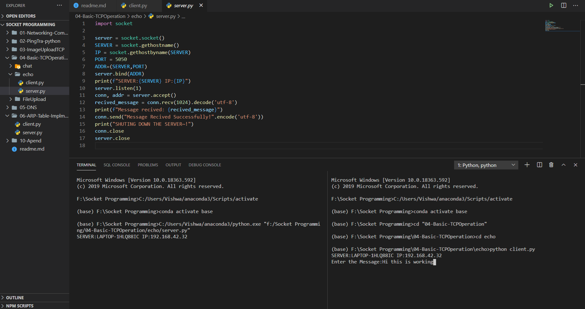
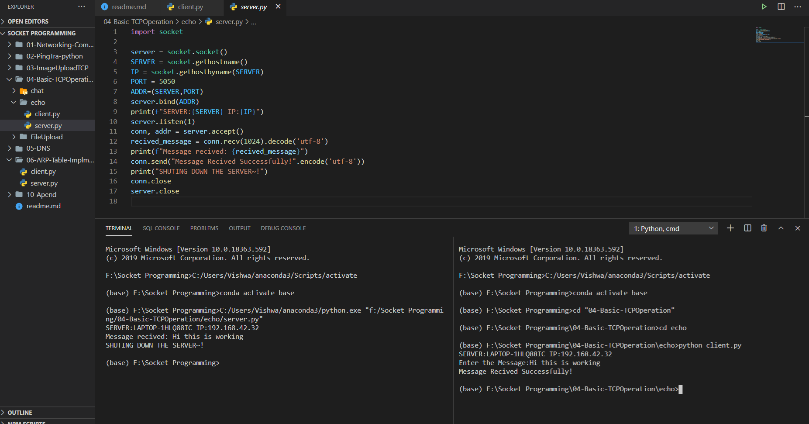

## Socket Programming Using Python


**Package Dependencies**
1. Socket - for TCP Connection
2. Pickle - dumping and loading files

```bash
pip install socket
pip install pickle
pip install pythonping
```

#### Basic Operation in Socket

* When sending message from client or server. Encode /Decode the message before send /recive.

**Server.py**

```python
import socket

server = socket.socket()
SERVER = socket.gethostname()
IP = socket.gethostbyname(SERVER)
PORT = 5050
ADDR=(SERVER,PORT)
server.bind(ADDR)
print(f"SERVER:{SERVER} IP:{IP}") 
server.listen(1)
conn, addr = server.accept()
recived_message = conn.recv(1024).decode('utf-8')
print(f"Message recived: {recived_message}")
conn.send("Message Recived Successfully!".encode('utf-8'))
print("SHUTING DOWN THE SERVER~!")
conn.close
server.close
```
**Client.py**
```python
import socket

server = socket.socket() #socket object
SERVER = socket.gethostname() #get machine host
IP = socket.gethostbyname(SERVER) 
PORT = 5050
ADDR=(SERVER,PORT) #address
server.connect(ADDR) #connect socket

message=input("Enter the Message:")
server.send(message.encode())
smessage = server.recv(1024).decode('utf-8')
print(smessage)
server.close
```


<br>